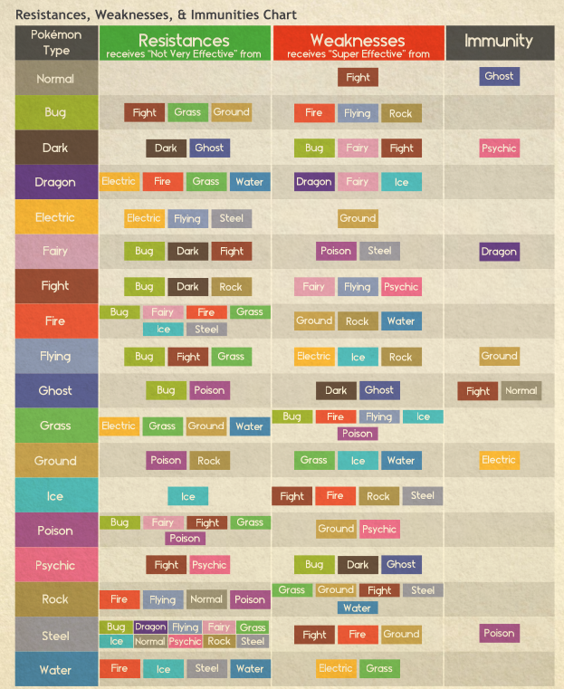

## Type Chart

### Type Rules
#### Resistances
All Pokémon Types (with the exception of Normal
Type) are able to resist certain Move Types.

This kind of protection makes the damage
received _**Not very effective reducing**_ 1 point
from the total damage received.

#### Weaknesses
All Pokémon are weak to certain Move Types.

This vulnerability makes the damage taken
_**Super Effective**_ meaning the Pokémon will
receive 1 additional point of damage from the
attack but the roll MUST score at least 1 Success.

#### Immunities
A few Pokémon Types are _**Immune**_ to other
specific Types of damage.

They will not receive any damage from
attacks of that type, but may still be affected
by support moves.

#### Double Resistance/Weakness
Two types may share a resistance, this means
that a double-type Pokémon may reduce up
to 2 damage points from an attack that is _**Not
very effective**_ against both of its Types.

The same rule applies when receiving a
_**Super Effective**_ attack. If both of the Pokémon’s Types share a Weakness, the Pokémon
will receive 2 additional damage.

## Combat Actions
|Multiple Action|Successes|
|-|-|
|1st Action|1|
|2nd Action|2|
|3rd action|3|
|4th action|4|
|5th action|5|
You can only perform a max of 5 actions per round

### Clash Rules
Once per round, when an opponent attacks you may clash using a damaging move. A successful clash will result in each taking 1 point of damage rather than the attacker rolling damage. Type Effectiveness still takes place.

### Evasion rules
At the cost of an action (Regardless of Initiative order) you can attempt to evade an attack. Any subsequent actions will be subject to the multiple actions table.  
If you roll as many successes or better, you evade the attack taking no damage **`Dexterity + Evasion`**

### STAB
Add a +1 bonus to the damage pool of attacks matching your type.

## Criticals
### Critical Hits
To land a Critical Hit you have to role 3 more successes than what is required for your accuracy roll. If you do Add 2 dice to your damage pool.

High-Crit moves only require 2.

### Critical Successes
![[meta.homebrewold#^ww33jdu5l3j4:#^aor8ncn2ouqy]]

## Status Effects
|Condition|Effect|Resist|Duration|
|-|-|-|
|Burn|At the end of each round inflict X point(s) of damage. Anything above 1 is lethal.|Type Immune|Action of Dex+Ath additive until reaching 2, 4, or 6|
|Paralysis|Lose 2 points in Dex, and move at half speed.|Type Immune|24 Hrs|
|Frozen|Cannot perform any action.|Type Immune. See [[meta.statblocks#Frozen]]. At the end of a round, a breakout can be attempted.|Until melts after 3 Hours or broken. If melting, the frozen target will be found Fainted.|
|Poison|1 Point of damage at the end of each round. Higher level is Lethal|If the target lies down and doesn't move. they will take 1/hr rather than 1/rnd.|Until Medical Attention, or fainting waking up 8 hours later, Higher levels is Medical only or until dead. Roll to resist every hour|
|Sleep|Cannot perform any actions|Roll insight additive to 5 to wake up|5 minutes.|
|Flinch|Lose Turn.|None|1 Round|
|Confused|Remove 1 success from all actions, if fail take 1 damage|Roll insight at the beginning of each round, 2 or more and act normally.|5 rounds|
|Disabled|Cannot use disabled Move|None|5 Rounds or 1 Combat|
|Infatuated|Half damage against foe and allies|Same gender or genderless immune. Same as Confused|1 Combat.|