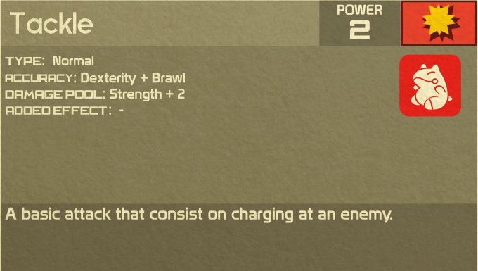

# Scope
The goal of this document is to integrate certain functions of the Pokerole system and the PMD Add-on module within the D&D 5E system. It will largely express the current problems I have with the current Pokerole system and hope to address them. This will be run in sections to explain each core concept of both 5E and Pokerole, how they are planned to be merged, as well as a conversion system for the Moves.

For context this will only assume the setting is for the PMD Add-on and all player characters will be assuming the role of Pokemon.

# Character Creation
For the process of character creation, you'll largely follow the process of 5E for creating a character. Depending on your DM's preference of either Point Buy or Rolls. 

There are exceptions. Due to the nature of Magic using classes and Pokemon, it's advised that they be avoided where possible. As most magic casting could be replaced for Pokemon using Moves.

## 5E Specific Stats
For this, Use [This site](https://pokedex-5e.herokuapp.com/) but ignore references to Moves, this is an incomplete list. Take note of the Hit Die and Movement Speeds and Size Class, which is required for the remainder of your character creation. 

# Pokemon Moves
This will heavily utilize the Pokerole rulebook, with adaptations to 5E See the table below for Equivalent Stats.

|Pokerole|D&D 5E|
|-:|:-|
|Strength|Strength|
|Dexterity|Dexterity|
|Vitality|Constitution|
|Special|Intelligence|
|Insight|Wisdom|
|Social Attributes[^1]|Charisma|
[^1]:Social attributes in this case are **Tough**, **Cool**, **Beauty**, **Cute**, and **Clever**. These are all rolled into the Charisma stat.

The moves a pokemon may learn are equal to their CL + WIS Modifier.
The Level of theses moves are also determined by CL using rank conversion.

## Using Moves
All moves are run against the AC of your opponent. To use a move Roll a 20-sided die and add the appropriate Attribute from the move's accuracy pool.

Below is an example using the move Tackle.

Tackle

Seen above is the card for the move Tackle. When rolling to hit, take the Accuracy pool, and drop the Skill portion of it (Usually the second value), and Match it with the appropriate base Attribute.

If you hit, Roll the damage pool using your Hit Die + the Listed Attribute. (If no attribute is listed for the move or if the move specifies a specific damage type, just roll your hit die with no modifiers.)

#### Example
In a greater example. lets say you have a D&D Dexterity of 14 and Strength of 16. this would give you a +2 and +3 respectively as modifiers. And your Hit Die is a d8

You want to use the move Tackle, Roll to hit against the opponents AC, You rolled a 14 add the 2 from your DEX for a total of 16 to hit!

The attack hits! you roll a D8 for damage and add your STR. You rolled a 7 for a total of 10!

### Special Cases
In the event the move you want to use uses a Social Attribute (see [^1]) you simply replace it with your Charisma Modifier.

## Weakness, Resistance, and STAB
This section will cover how to calculate for your weakness, resistance, and STAB

#### Weakness
If you are weak against a certain move you take more damage than you normally would (+2, and +4 in cases of Double Super Effective.)

#### Resistance
If you resist a certain move you take less damage (-2, and -4 in cases of Double Not Very Effective, unless you are immune in which you take no damage)

#### STAB
Same Type Attack Bonus will let you add your CL divided by 4 rounded down.

# Homebrew Variant Rules
I tend to disagree with the WotC and Pokerole on certain things. Below you can find the Rule Variants I use in my game.

## Death Saves (Variant)
Roll death saves as normal. However taking damage does not constitute an auto-fail. For every 5 points (after DR) of damage you take, increase the Death Save DC by 1 for that round.

## Difficulty Class Gradient
Due to my DMing Style, I am a Narrative First DM, meaning above all else, the story, the player's interactions with the world, and how the world reacts around them, come first.

In "Rules as Written" DC checks are largely you either Hit the DC or you fail. Frankly speaking, this sucks. and I much prefer utilizing this variant rule.

When interacting with an NPC, if you do not succeed the skill check *but fall within a few points short* things will swing in your favor, but not entirely. Just because you didn't pass the check doesn't mean your words did nothing.

This rule will be applied at the DMs discretion and when it applies will be largely unknown to the player for full immersion.

## Primal
### Trait
*When your back is against the wall, you need to stand tall, for one final hit.*

When you reach Zero hit points, Before you go down, but after you take the hit points, as a Reaction, you can spend a Primal point to restore 1d6+Con Mod of HP, Restore 1 point to all class and racial abilities, and if applicable 1 spell slot of your choice. In addition, you are still standing and still have any applicable actions on your turn. You can use this ability Twice per combat.

The amount of Primal you have will be equal to your Strength Mod + Constitution Mod. When an encounter ends, you will immediately fall unconscious and fall to 1 HP regardless of whether or not you were healed, due to the strain it took on your body. You regain 1 Primal point per long rest.

Upon spending your last point of Primal your damage is Doubled. However at the end of combat you will fall to Zero HP and roll Death Saves.

[^2]:*[CL]: Character Level 
*[WIS]: Wisdom Modifier
*[DEX]: Dexterity Modifier
*[STR]: Strength Modifier
*[DC]: Difficulty Class
*[AC]: Armor Class
*[STAB]: Same Type Attack Bonus
*[DR]: Damage Reduction